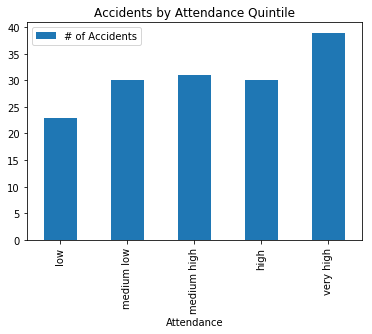
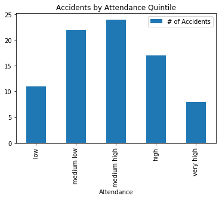
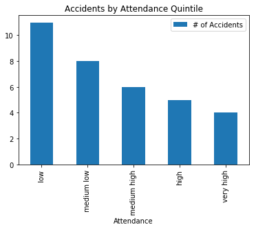

# Blue Jays Home Games
> A Data Science Project deliverable for the SCS3250-027 - Introduction to Data Science course @ the University of Toronto (Summer 2019)

### Table of Contents
1. [Hypothesis](#hypothesis)
2. [Datasets](#datasets)
3. [Methodology](#methodology)
4. [Findings](#findings)
5. [Jupyter Notebooks](#jupyter-notebooks)

### Hypothesis
Does higher attendance at Blue Jays home games in Toronto translate to increased incidences of killed or seriously injured accidents in the immediate vicinity of the Rogers Centre? It turns out the answer isn't so straightforward. Here I present a basic Data Science analysis of this question using `numpy` and `pandas` libraries along with a few publicly available data sets.

### Datasets
1. The Toronto Police Service publishes a [Killed and Seriously Injured (KSI)](https://data.torontopolice.on.ca/datasets/9f05c21dea4c40458264cb3f1e2362b8_0) dataset which contains a compilation of all recorded incidents on Toronto roads from the years 2008 to 2018. This datset contains information about what vehicle types were involved in accidents, whether injuries were fatal or non-fatal, locations, and datetimes.

2. [Sports Reference](https://www.baseball-reference.com/teams/TOR/2018-schedule-scores.shtml) provides us with a historically accurate list of all Toronto Blue Jays regularly scheduled games from the 1980s onwards which includes dates, durations, whether or not the game occured during the day or night, as well as attendance.

### Methodology
Using both datasets, I filtered the KSI data using based on two criteria: a) specific time windows after Toronto Blue Jays home games at the Rogers Centre, b) distance from the Rogers Centre. The resulting filtered datasets were then be grouped by attendance quintiles. Dataframes for different values of criteria a) and b) were then created and plotted to attempt to prove or disprove the hypothesis.

### Findings

#### 5 hours and 5 kilometres

- Here we see that the data correlates generally with the stated hyptothesis. As the attendance increases, the number of accidents increases.

#### 5 hours and 3 kilometres

- Reducing the radius from the Rogers Centre, an interesting trend emerges only for games with high attendance. It seems that the number of accidents drops. This is likely due to so much traffic flooding the nearby streets and causing so much congestion that the roads become safer.

#### 2 hours and 3 kilometres

- Reducing the time window after games shows the opposite trend from the first graph and correctly predicts our assumptions about why the second graph trend behaves the way it does. 

### Jupyter Notebooks
1) Part 1 - [Prepare Blue Jays Data Set](https://github.com/kcarmonamurphy/blue-jays-home-games/blob/master/Part%201%20-%20Prepare%20Blue%20Jays%20Data%20Set.ipynb)
2) Part 2 - [Analyse KSI & Draw Conclusions](https://github.com/kcarmonamurphy/blue-jays-home-games/blob/master/Part%202%20-%20Analyse%20KSI%20%26%20Draw%20Conclusions.ipynb)
